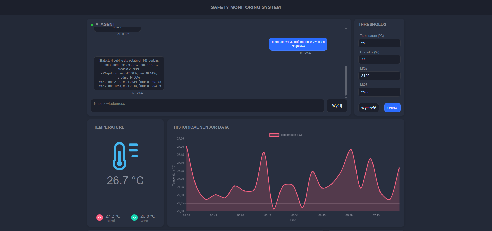
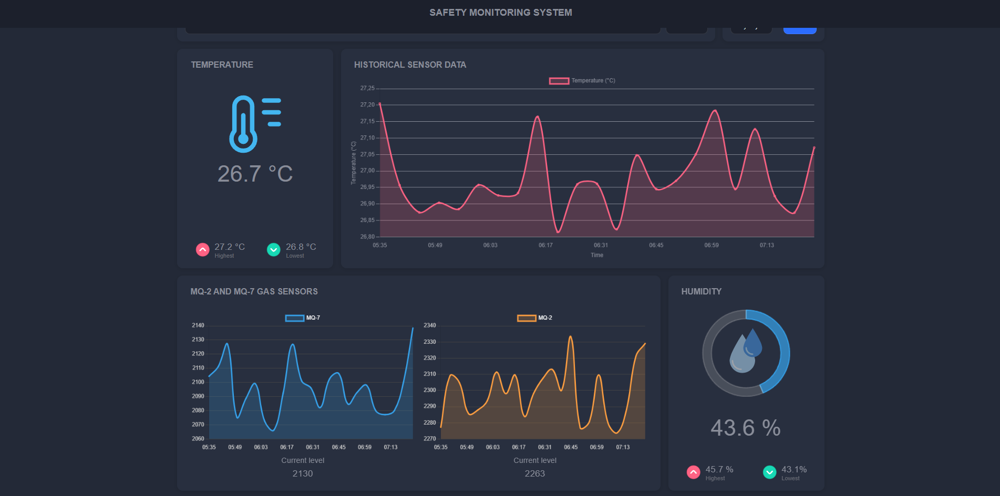
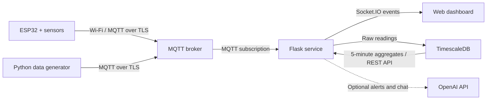

# ESP32 Sensor System

ESP32 Sensor System is a small IoT monitoring project. It collects environmental
data, shows live values in a web dashboard, and stores measurements for
historical charts.

The main data source is an ESP32 connected to physical sensors. For development
and testing, a Python desktop application can generate the same type of data
without any hardware.

## Dashboard





## Project goal

The goal of this project is to show a complete IoT data flow:

- read temperature, humidity, and gas sensor values;
- send measurements over Wi-Fi using MQTT;
- update a browser dashboard in real time;
- save measurements in a time-series database;
- display the last 24 hours as historical charts;
- test the system without an ESP32 by using generated data.

The ESP32 sketch supports a DHT22 temperature and humidity sensor, an MQ-2 gas
sensor, and an MQ-7 carbon monoxide sensor.

## Data flow



1. The ESP32 reads sensor values and publishes a JSON message to an MQTT topic.
2. The Python generator can publish messages in the same format instead.
3. The Flask service subscribes to the topic and normalizes the received values.
4. Every new reading is sent to the dashboard with Socket.IO and saved in
   TimescaleDB.
5. TimescaleDB creates 5-minute averages. The dashboard uses them for the
   historical charts from the last 24 hours.
6. Optional warning thresholds and OpenAI integration can provide alerts and
   sensor-related chat responses.

## Technologies

- **ESP32 and Arduino** read physical sensors and provide a low-cost IoT device.
- **Wi-Fi and MQTT** provide a lightweight way to send sensor messages.
- **Python and Paho MQTT** receive MQTT messages and also power the test data
  generator.
- **Flask** serves the dashboard and REST endpoints.
- **Flask-SocketIO** pushes current readings to the browser without page
  refreshes.
- **TimescaleDB** stores time-series data efficiently and calculates continuous
  5-minute aggregates.
- **HTML, CSS, JavaScript, and Chart.js** build the dashboard and its charts.
- **Docker Compose** starts the web service and database in a repeatable local
  environment.
- **BrowserSync** provides automatic browser reloads during development.
- **OpenAI API (optional)** supports the dashboard chat and explanations for
  sensor alerts.

## MQTT message format

Both data sources publish JSON to the topic configured by `MQTT_TOPIC`:

```json
{
  "timestamp": "2026-07-30 12:30:00",
  "temperature": 24.6,
  "humidity": 48.2,
  "mq2": 1250,
  "mq7": 980
}
```

The backend currently replaces the supplied timestamp with its own local receive
time. Sensor limits accepted by the application are:

- humidity: `0-100%`;
- MQ-2 and MQ-7 raw ADC values: `0-4095`.

## Run with Docker

### Requirements

- Docker with Docker Compose;
- access to an MQTT broker with TLS support;
- MQTT credentials for the backend subscriber;
- optional publisher credentials for the Python generator.

### Configuration

Create a local environment file:

```powershell
Copy-Item .env.example .env
```

On Linux or macOS:

```bash
cp .env.example .env
```

Edit `.env` and set at least:

```dotenv
MQTT_HOST=your-cluster.example.com
MQTT_PORT=8883
MQTT_TOPIC=production/sensor/all
MQTT_CLIENT_ID=esp32-sensor-backend
MQTT_DEVICE_ID=esp32-1
MQTT_USERNAME_SERVER=your-backend-username
MQTT_PASSWORD_SERVER=your-backend-password
MQTT_USERNAME=your-generator-username
MQTT_PASSWORD=your-generator-password
MQTT_USE_TLS=true
POSTGRES_PASSWORD=change-this-password
SECRET_KEY=change-this-secret
```

The OpenAI settings are optional. Leave `OPENAI_API_KEY` empty if chat and
AI-generated alerts are not needed.

### Start the services

```bash
docker compose up --build -d
```

Open:

- `http://localhost:3000` for the development dashboard with automatic reload;
- `http://localhost:5000` for the Flask application directly.

To view logs:

```bash
docker compose logs -f app
```

To stop the project:

```bash
docker compose down
```

The database is stored in the `postgres_data` Docker volume. A normal
`docker compose down` does not remove it.

## Use the ESP32

Open `esp32_mqtt/esp32_mqtt.ino` in the Arduino IDE and configure:

- Wi-Fi name and password;
- MQTT host, username, and password;
- MQTT topic, if it is different from the backend configuration.

Install the required Arduino libraries:

- `PubSubClient`;
- `DHT sensor library`.

The current pin configuration is:

| Sensor | ESP32 pin |
| ------ | --------: |
| DHT22  |        26 |
| MQ-2   |        34 |
| MQ-7   |        35 |

Upload the sketch to the ESP32. It publishes one reading every second.

## Use the Python data generator

The generator is a desktop GUI and runs outside Docker. It is useful when the
ESP32 or sensors are not available.

Create a Python environment and install the project packages:

```powershell
python -m venv .venv
.\.venv\Scripts\Activate.ps1
pip install -r requirements.txt
python tools\fake_data_generator.py
```

For Linux or macOS, activate the environment with `source .venv/bin/activate`
and run `python tools/fake_data_generator.py`. Tkinter must be available in the
local Python installation.

The generator uses `MQTT_USERNAME` and `MQTT_PASSWORD` from `.env`. It can send
manual values or smoothly generate values inside selected ranges.

## Database behavior

TimescaleDB stores every received sample in the `sensor_readings` hypertable. A
continuous aggregate named `sensor_readings_5m` creates 5-minute averages for
historical charts. Raw readings are automatically removed after 7 days.

Database initialization is located in `docker/db/init.sql`. It only runs when a
new database volume is created.

## Project structure

```text
app/                  Flask application, API, MQTT and database services
assets/               README screenshots
docker/db/init.sql    TimescaleDB schema and policies
esp32_mqtt/           ESP32 Arduino sketch
frontend/             Dashboard templates, styles and JavaScript
tools/                Python MQTT data generator
compose.yaml          Local Docker services
Dockerfile            Flask application image
run.py                Application entry point
```

## Notes

- This Compose setup is intended for local development. It uses source-code
  mounts, Flask debug settings, Gunicorn reload, and BrowserSync.
- The MQTT broker is not included in `compose.yaml`; the project expects an
  external broker such as a managed MQTT cluster.
- Do not commit `.env` or real Wi-Fi and MQTT credentials.
- The ESP32 sketch currently uses `setInsecure()` for MQTT TLS. Certificate
  verification should be enabled before using the device in production.
